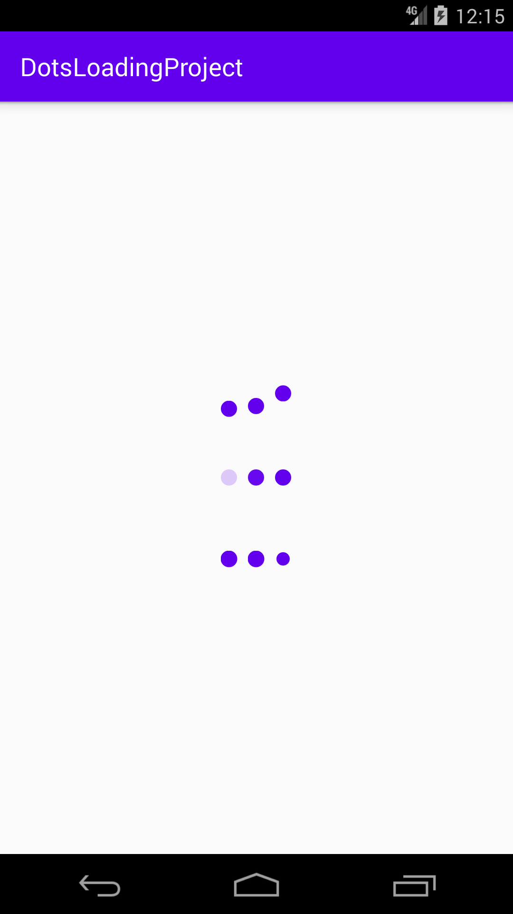
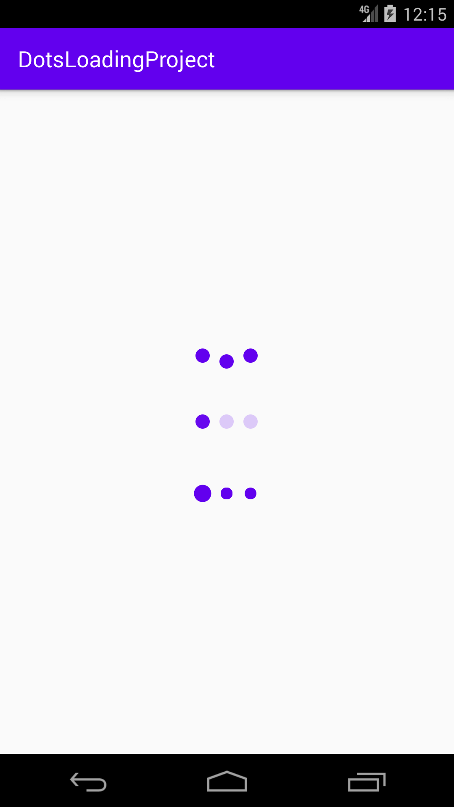

# Android-Loading-Dots
simple Library to have Progresses dots loading
## Developed by Mahdi Razzaghi Ghaleh

# Step1. Add it in your root build.gradle at the end of repositories:
	allprojects {
		repositories {
			...
			maven { url 'https://jitpack.io' }
		}
	}

# Step 2. Add the dependency
	dependencies {
	        implementation 'com.github.razaghimahdi:Android-Loading-Dots:Tag'
	}
	Current Ver:"1.0.0"

# Done

# NOTE:
To change width and height:
android:layout_width="50dp"
android:layout_height="30dp"
To change dot color:
android:background="@color/exampleColor"

